# Project: LinkedIn Scrapp — Trigger.dev Tasks

## Architecture

- **Runtime**: Trigger.dev v3 (`schedules.task`)
- **Deploy**: GitHub Actions → Trigger.dev (on push to `main` or `staging`)
- **Project ref**: `proj_qnvzrrduyvfunicemipq`
- **Env vars**: configured in Trigger.dev dashboard (not in code), per environment
- **Cron**: configured via Trigger.dev dashboard (not in code)
- **Secret key (prod)**: `tr_prod_TOBy4NubZXOQASLQDR2n` — used for Management API auth

## Trigger.dev Management API

Base URL: `https://api.trigger.dev`, auth via `Authorization: Bearer <secret_key>`.

- **List env vars**: `GET /api/v1/projects/proj_qnvzrrduyvfunicemipq/envvars`
- **Create env var**: `POST /api/v1/projects/proj_qnvzrrduyvfunicemipq/envvars/{env}` with `{"name":"VAR_NAME","value":"value"}` (env = `dev`, `staging`, or `prod`)
- **List runs**: `GET /api/v1/runs?filter[status]=FAILED&page[size]=10`
- **Get run details**: `GET /api/v3/runs/{runId}` (includes `error` field with name, message, stackTrace)

## Key Files

- `trigger/get-profil-views.ts` — scrapes LinkedIn profile viewers via GraphQL Voyager endpoint
- `trigger/get-strategic-connections.ts` — scrapes Sales Navigator saved searches for new concurrent profiles
- `trigger/get-strategic-people.ts` — scrapes Sales Navigator saved searches for strategic people (CIO, PMO, etc.)
- `trigger/get-team-connections.ts` — fetches 1st-degree LinkedIn connections for all team members
- `trigger/lgm-process-intent-events.ts` — processes J-1 intent events + concurrent contacts → routes to LGM or HubSpot, sends grouped Slack recap. Also exports `lgm-process-intent-events-10-days` backfill task (same logic, 10-day lookback). Logs every routing decision to `lgm_send_log` for audit.
- `trigger/audit-lgm-sends.ts` — weekly audit: queries `lgm_send_log` (7 days), compares with LGM audience sizes via API, posts report to `script_logs` Slack
- `trigger/hubspot-cleanup-email-associations.ts` — removes parasitic email-contact associations in HubSpot (emails with >3 contacts where contact not in from/to/cc/bcc)
- `trigger/import-linkedin-messages.ts` — imports LinkedIn messages from last 24h via Unipile → Supabase, sends 1:1 messages to HubSpot (communication) + Zapier webhook
- `trigger/weekly-meetings-recap.ts` — weekly Monday recap of HubSpot meetings in SQL pipeline, enriched with AI (Anthropic Sonnet) and sent to Slack
- `trigger/weekly-unanswered-recap.ts` — weekly Friday 8h30 recap of unanswered LinkedIn messages (all team) + Gmail emails (Bertran) with AI classification (Claude Sonnet) to filter spam/noise, posted to Slack via `webhook_unanswered_recap`
- `trigger/deal-clean-alert.ts` — alerts on deals needing cleanup (date dépassée, sans date en RDV à planifier, sans montant après Demo) via Zapier webhook
- `trigger/data-freshness-check.ts` — daily monitoring of Supabase table freshness (PRC_INTENT_EVENTS, scrapped_visit, scrapped_reaction, messages, threads), uses Claude Sonnet for anomaly detection, alerts on script_logs
- `trigger/sync-modjo-calls.ts` — syncs Modjo calls (transcripts, participants, HubSpot IDs, AI summaries) to Supabase `modjo_calls` table via Modjo API, hourly cron
- `trigger/send-contacts-to-langgraph.ts` — daily cron: fetches PRC_CONTACT_ACTIVITIES (ai_ae_sdr_agent Supabase `rcpcdpxqjxeikbssprdz`), skips contacts with final_decision < 3 days, prioritizes active pipeline SQL deals (Tier 1) then FIFO by oldest decision, caps at 30 contacts/run, sends to LangGraph async /runs endpoint
- `trigger/batch-crisp-to-supabase.ts` — manual batch import of Crisp conversations/messages to Supabase (tchat-support-sync project)
- `trigger/daily-batch-crisp-to-supabase.ts` — automated daily batch import (cron hourly, 25h min gap, cursor in `tchat_batch_cursor_tmp`). Temporary task — remove once historical import is complete.
- `trigger/sync-crisp-to-supabase.ts` — incremental cron sync of Crisp conversations/messages to Supabase (tchat-support-sync project)
- `trigger/import-circle-posts.ts` — weekly sync of Circle posts + comments from `ca-vient-de-sortir` space → Supabase `circle_posts` (tchat-support-sync project), incremental via `circle_sync_cursor`
- `trigger/generate-faq-document.ts` — manual task: reads `tchat_faq_extractions` (score >= 3), consolidates themes + deduplicates via Claude Opus in batches, generates structured Markdown FAQ document, saves to `tchat_faq_documents`
- `trigger/audit-circle-documentation.ts` — manual task: cross-references FAQ extractions with Circle articles, produces audit report with article rewrites (image-preserving), new article drafts, and orphan detection. Resume support via `tchat_doc_audit_items`. Saves to `tchat_faq_documents` with type `doc_audit`
- `trigger/propose-faq-updates.ts` — manual monthly task: compares recent Crisp extractions + Circle articles against approved FAQ reference, produces HTML proposal with new questions, answer updates (before/after diff), removals, and Circle article suggestions. 2-pass Opus architecture. Saves to `tchat_faq_documents` with type `faq_proposal`
- `trigger/lib/unipile.ts` — Unipile API client (rawRoute, getUser, search, getRelations, getChats, getChatMessages, getChatAttendees, getEmails)
- `trigger/lib/supabase.ts` — Supabase client (lazy-init via Proxy)
- `trigger/lib/crisp.ts` — Crisp REST API client (Basic auth, rate limit 500/24h, lazy-init)
- `trigger/lib/crisp-supabase.ts` — Supabase client for tchat-support-sync project `oqiowupiczgrezgyopfm` (lazy-init, dedicated env vars)
- `trigger/lib/circle-supabase.ts` — Supabase helpers for Circle posts sync (upsert posts, sync cursor) on tchat-support-sync project
- `trigger/lib/utils.ts` — shared helpers (sleep, parseViewedAgoText, etc.)

## Task Flow Diagrams

> **Rule**: Update these diagrams whenever a task is modified.

### Overview

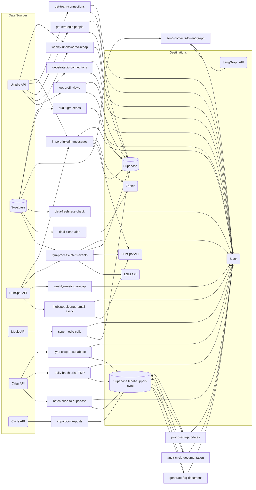
```mermaid
flowchart LR
    subgraph src ["Data Sources"]
        UN(Unipile API)
        SB[(Supabase)]
        HS_I(HubSpot API)
        MJ(Modjo API)
        CR(Crisp API)
        CI(Circle API)
    end

    subgraph dst ["Destinations"]
        LGM_O(LGM API)
        HS_O(HubSpot API)
        SB_O[(Supabase)]
        SB_CR[(Supabase tchat-support-sync)]
        SL(Slack)
        ZP(Zapier)
        LG(LangGraph API)
    end

    UN --> GPV[get-profil-views] & GSC[get-strategic-connections] & GSP[get-strategic-people] & GTC[get-team-connections] & ILM[import-linkedin-messages]
    SB --> LPI[lgm-process-intent-events] & DCA[deal-clean-alert] & DFC[data-freshness-check] & SCL[send-contacts-to-langgraph]
    HS_I --> HCE[hubspot-cleanup-email-assoc] & WMR[weekly-meetings-recap] & LPI & ILM
    MJ --> SMC[sync-modjo-calls]
    CR --> BCS[batch-crisp-to-supabase] & DBCS[daily-batch-crisp TMP] & SCS[sync-crisp-to-supabase]
    SB --> WUR[weekly-unanswered-recap]
    UN --> WUR

    GPV --> SB_O & SL
    GSC --> SB_O & SL
    GSP --> SB_O & SL
    GTC --> SB_O & SL
    LPI --> LGM_O & HS_O & SB_O & SL
    SB --> ALS[audit-lgm-sends]
    ALS --> SL
    HCE --> HS_O & SL
    ILM --> SB_O & HS_O & ZP & SL
    WMR --> SL
    DCA --> ZP
    DFC --> SL
    SMC --> SB_O & SL
    SCL --> LG & SL
    BCS --> SB_CR & SL
    DBCS --> SB_CR & SL
    SCS --> SB_CR & SL
    CI --> ICP[import-circle-posts]
    ICP --> SB_CR
    SB_CR --> GFD[generate-faq-document]
    GFD --> SB_CR & SL
    SB_CR --> ACD[audit-circle-documentation]
    ACD --> SB_CR & SL
    SB_CR --> PFU[propose-faq-updates]
    PFU --> SB_CR & SL
    WUR --> SL
```

### `get-profil-views` (daily)

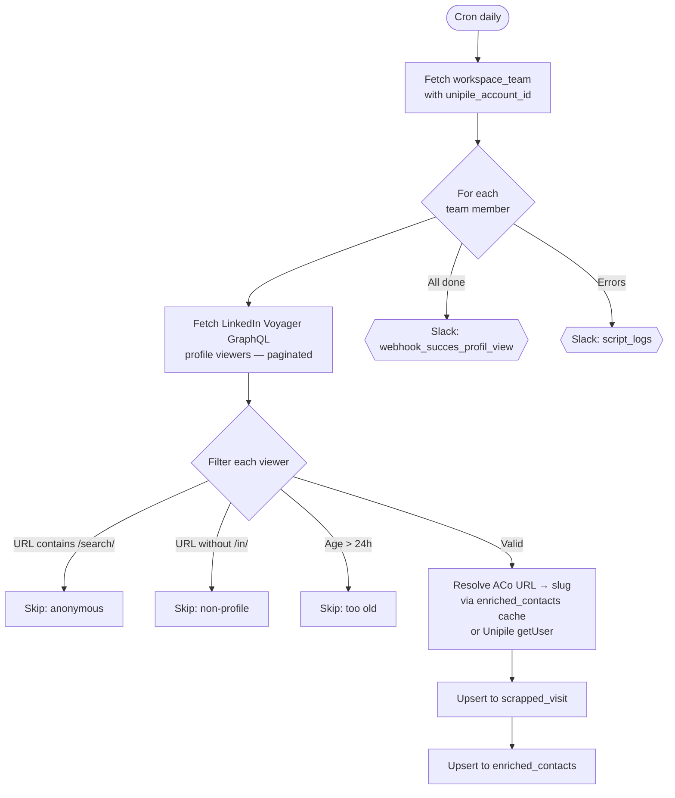
```mermaid
flowchart TD
    A([Cron daily]) --> B[Fetch workspace_team<br/>with unipile_account_id]
    B --> C{For each<br/>team member}
    C --> D[Fetch LinkedIn Voyager GraphQL<br/>profile viewers — paginated]
    D --> E{Filter each viewer}
    E -->|URL contains /search/| F[Skip: anonymous]
    E -->|URL without /in/| G[Skip: non-profile]
    E -->|Age > 24h| H[Skip: too old]
    E -->|Valid| I[Resolve ACo URL → slug<br/>via enriched_contacts cache<br/>or Unipile getUser]
    I --> J[Upsert to scrapped_visit]
    J --> K[Upsert to enriched_contacts]
    C -->|All done| L{{Slack: webhook_succes_profil_view}}
    C -->|Errors| M{{Slack: script_logs}}
```

### `get-strategic-connections` (daily)

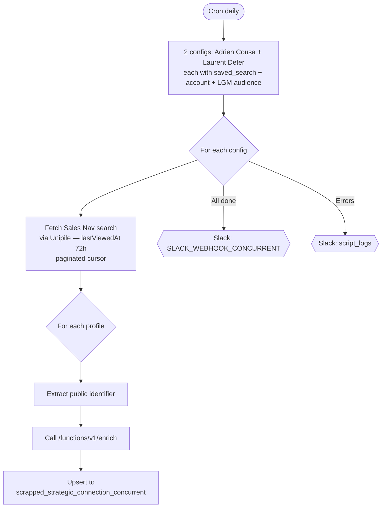
```mermaid
flowchart TD
    A([Cron daily]) --> B[2 configs: Adrien Cousa + Laurent Defer<br/>each with saved_search + account + LGM audience]
    B --> C{For each config}
    C --> D[Fetch Sales Nav search<br/>via Unipile — lastViewedAt 72h<br/>paginated cursor]
    D --> E{For each profile}
    E --> F[Extract public identifier]
    F --> G[Call /functions/v1/enrich]
    G --> H[Upsert to<br/>scrapped_strategic_connection_concurrent]
    C -->|All done| I{{Slack: SLACK_WEBHOOK_CONCURRENT}}
    C -->|Errors| J{{Slack: script_logs}}
```

### `get-strategic-people` (daily)

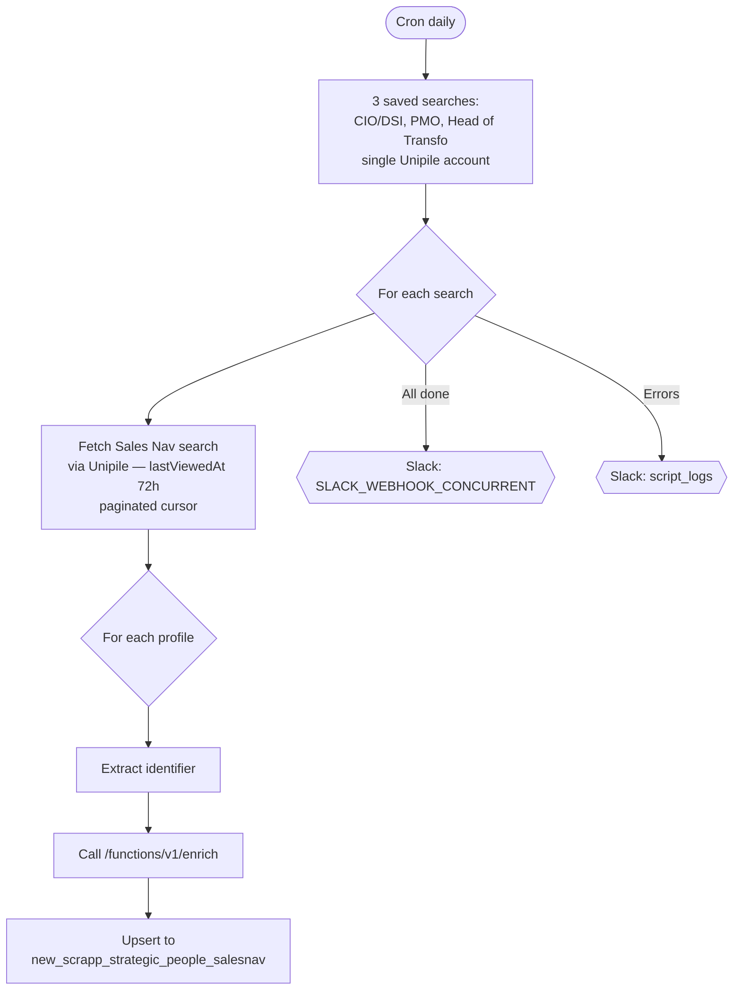
```mermaid
flowchart TD
    A([Cron daily]) --> B[3 saved searches:<br/>CIO/DSI, PMO, Head of Transfo<br/>single Unipile account]
    B --> C{For each search}
    C --> D[Fetch Sales Nav search<br/>via Unipile — lastViewedAt 72h<br/>paginated cursor]
    D --> E{For each profile}
    E --> F[Extract identifier]
    F --> G[Call /functions/v1/enrich]
    G --> H[Upsert to<br/>new_scrapp_strategic_people_salesnav]
    C -->|All done| I{{Slack: SLACK_WEBHOOK_CONCURRENT}}
    C -->|Errors| J{{Slack: script_logs}}
```

### `get-team-connections` (daily)

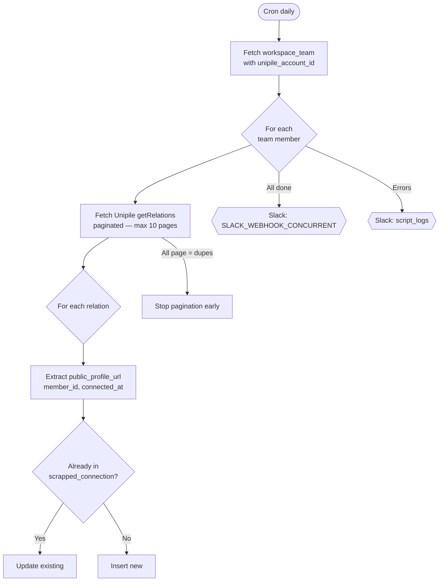
```mermaid
flowchart TD
    A([Cron daily]) --> B[Fetch workspace_team<br/>with unipile_account_id]
    B --> C{For each<br/>team member}
    C --> D[Fetch Unipile getRelations<br/>paginated — max 10 pages]
    D --> E{For each relation}
    E --> F[Extract public_profile_url<br/>member_id, connected_at]
    F --> G{Already in<br/>scrapped_connection?}
    G -->|Yes| H[Update existing]
    G -->|No| I[Insert new]
    D -->|All page = dupes| K[Stop pagination early]
    C -->|All done| L{{Slack: SLACK_WEBHOOK_CONCURRENT}}
    C -->|Errors| M{{Slack: script_logs}}
```

### `lgm-process-intent-events` (daily + 10-day backfill)

#### Intent Events Routing

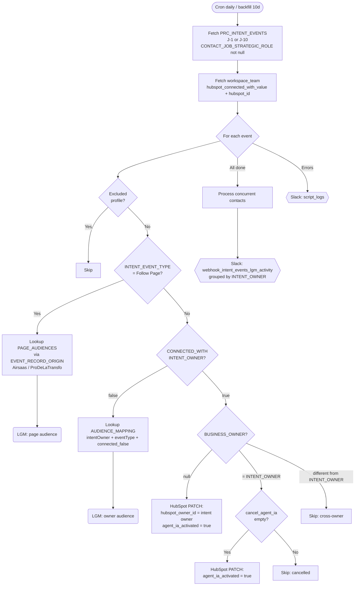
```mermaid
flowchart TD
    A([Cron daily / backfill 10d]) --> B[Fetch PRC_INTENT_EVENTS<br/>J-1 or J-10<br/>CONTACT_JOB_STRATEGIC_ROLE not null]
    B --> C[Fetch workspace_team<br/>hubspot_connected_with_value + hubspot_id]
    C --> D{For each event}

    D --> E{Excluded<br/>profile?}
    E -->|Yes| F[Skip]

    E -->|No| G{INTENT_EVENT_TYPE<br/>= Follow Page?}

    G -->|Yes| H[Lookup PAGE_AUDIENCES<br/>via EVENT_RECORD_ORIGIN<br/>Airsaas / ProDeLaTransfo]
    H --> I(LGM: page audience)

    G -->|No| J{CONNECTED_WITH<br/>INTENT_OWNER?}

    J -->|false| K[Lookup AUDIENCE_MAPPING<br/>intentOwner + eventType + connected_false]
    K --> L(LGM: owner audience)

    J -->|true| M{BUSINESS_OWNER?}

    M -->|null| N[HubSpot PATCH:<br/>hubspot_owner_id = intent owner<br/>agent_ia_activated = true]

    M -->|= INTENT_OWNER| O{cancel_agent_ia<br/>empty?}
    O -->|Yes| P[HubSpot PATCH:<br/>agent_ia_activated = true]
    O -->|No| Q[Skip: cancelled]

    M -->|different from INTENT_OWNER| R[Skip: cross-owner]

    D -->|All done| S[Process concurrent contacts]
    S --> T{{Slack: webhook_intent_events_lgm_activity<br/>grouped by INTENT_OWNER}}
    D -->|Errors| U{{Slack: script_logs}}
```

#### Concurrent Contacts Routing

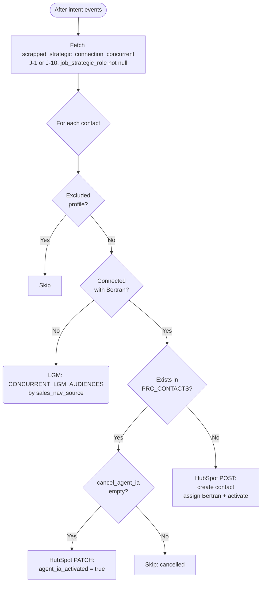
```mermaid
flowchart TD
    A([After intent events]) --> B[Fetch scrapped_strategic_connection_concurrent<br/>J-1 or J-10, job_strategic_role not null]
    B --> C{For each contact}

    C --> D{Excluded<br/>profile?}
    D -->|Yes| E[Skip]

    D -->|No| F{Connected<br/>with Bertran?}

    F -->|No| G(LGM: CONCURRENT_LGM_AUDIENCES<br/>by sales_nav_source)

    F -->|Yes| H{Exists in<br/>PRC_CONTACTS?}

    H -->|Yes| I{cancel_agent_ia<br/>empty?}
    I -->|Yes| J[HubSpot PATCH:<br/>agent_ia_activated = true]
    I -->|No| K[Skip: cancelled]

    H -->|No| L[HubSpot POST:<br/>create contact<br/>assign Bertran + activate]
```

### `audit-lgm-sends` (weekly Monday)

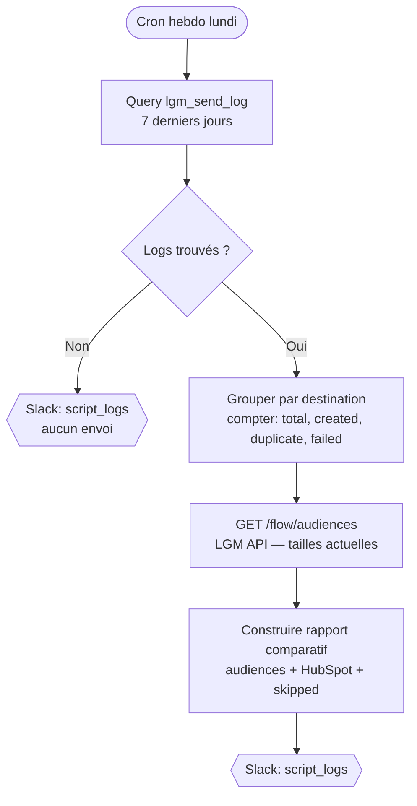
```mermaid
flowchart TD
    A([Cron hebdo lundi]) --> B[Query lgm_send_log<br/>7 derniers jours]
    B --> C{Logs trouvés ?}
    C -->|Non| D{{Slack: script_logs<br/>aucun envoi}}
    C -->|Oui| E[Grouper par destination<br/>compter: total, created, duplicate, failed]
    E --> F[GET /flow/audiences<br/>LGM API — tailles actuelles]
    F --> G[Construire rapport comparatif<br/>audiences + HubSpot + skipped]
    G --> H{{Slack: script_logs}}
```

### `hubspot-cleanup-email-associations` (daily)

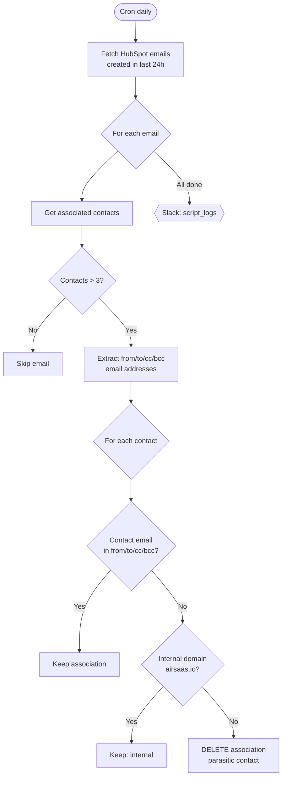
```mermaid
flowchart TD
    A([Cron daily]) --> B[Fetch HubSpot emails<br/>created in last 24h]
    B --> C{For each email}
    C --> D[Get associated contacts]
    D --> E{Contacts > 3?}
    E -->|No| F[Skip email]
    E -->|Yes| G[Extract from/to/cc/bcc<br/>email addresses]
    G --> H{For each contact}
    H --> I{Contact email<br/>in from/to/cc/bcc?}
    I -->|Yes| J[Keep association]
    I -->|No| K{Internal domain<br/>airsaas.io?}
    K -->|Yes| L[Keep: internal]
    K -->|No| M[DELETE association<br/>parasitic contact]
    C -->|All done| N{{Slack: script_logs}}
```

### `import-linkedin-messages` (hourly)

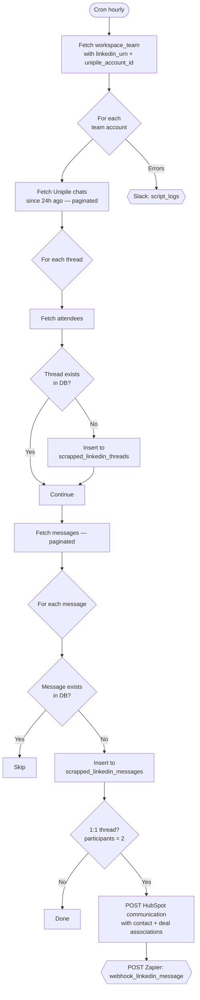
```mermaid
flowchart TD
    A([Cron hourly]) --> B[Fetch workspace_team<br/>with linkedin_urn + unipile_account_id]
    B --> C{For each<br/>team account}
    C --> D[Fetch Unipile chats<br/>since 24h ago — paginated]
    D --> E{For each thread}
    E --> F[Fetch attendees]
    F --> G{Thread exists<br/>in DB?}
    G -->|No| H[Insert to<br/>scrapped_linkedin_threads]
    G -->|Yes| I[Continue]
    H --> I
    I --> J[Fetch messages — paginated]
    J --> K{For each message}
    K --> L{Message exists<br/>in DB?}
    L -->|Yes| M[Skip]
    L -->|No| N[Insert to<br/>scrapped_linkedin_messages]
    N --> O{1:1 thread?<br/>participants = 2}
    O -->|No| P[Done]
    O -->|Yes| Q[POST HubSpot communication<br/>with contact + deal associations]
    Q --> R{{POST Zapier: webhook_linkedin_message}}
    C -->|Errors| S{{Slack: script_logs}}
```

### `weekly-meetings-recap` (weekly Monday)

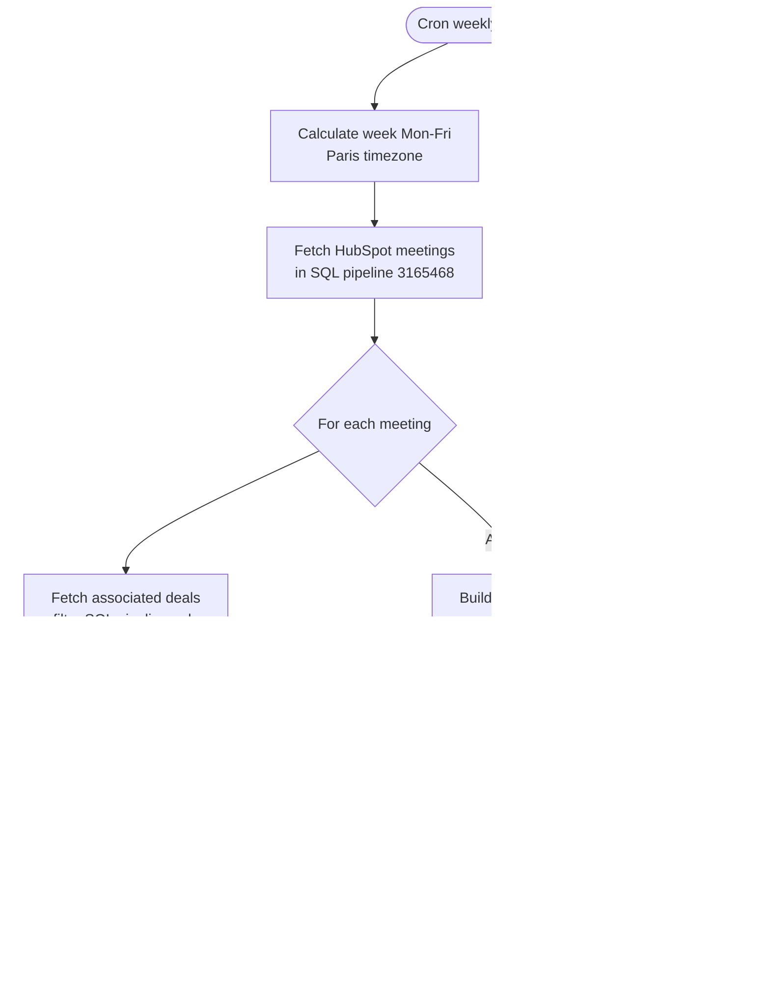
```mermaid
flowchart TD
    A([Cron weekly Monday]) --> B[Calculate week Mon-Fri<br/>Paris timezone]
    B --> C[Fetch HubSpot meetings<br/>in SQL pipeline 3165468]
    C --> D{For each meeting}
    D --> E[Fetch associated deals<br/>filter SQL pipeline only]
    E --> F[Fetch deal props:<br/>name, amount, stage, owner]
    F --> G[Fetch company name]
    D -->|All done| H[Build WeekData<br/>grouped by day]
    H --> I[Send to Anthropic Sonnet<br/>for AI recap]
    I -->|Success| J[Format with AI insight]
    I -->|Failure| K[Format with static template]
    J --> L{{Slack: webhook_sql_activity}}
    K --> L
    A -->|Fatal error| M{{Slack: script_logs}}
```

### `deal-clean-alert` (daily)

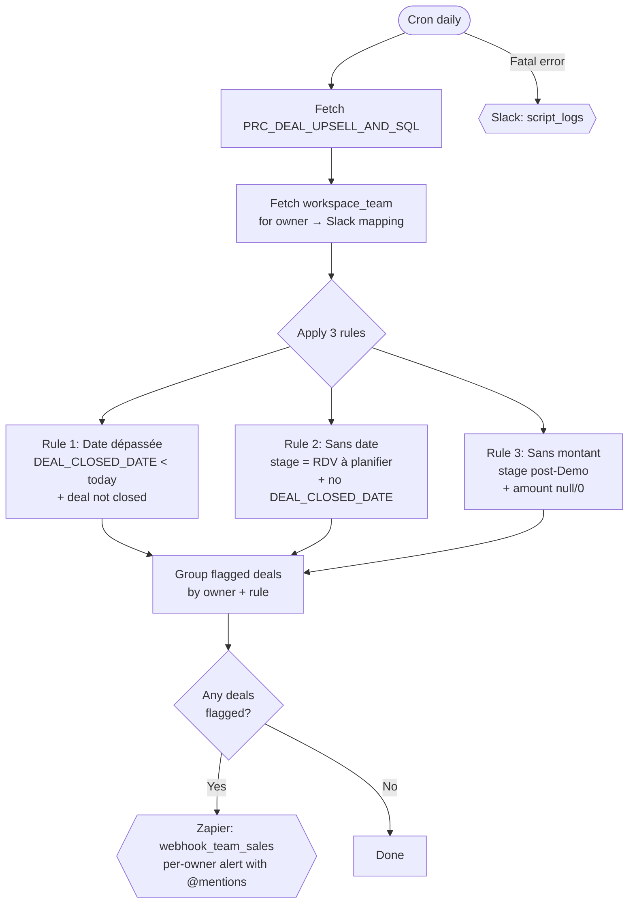
```mermaid
flowchart TD
    A([Cron daily]) --> B[Fetch PRC_DEAL_UPSELL_AND_SQL]
    B --> C[Fetch workspace_team<br/>for owner → Slack mapping]
    C --> D{Apply 3 rules}
    D --> E["Rule 1: Date dépassée<br/>DEAL_CLOSED_DATE < today<br/>+ deal not closed"]
    D --> F["Rule 2: Sans date<br/>stage = RDV à planifier<br/>+ no DEAL_CLOSED_DATE"]
    D --> G["Rule 3: Sans montant<br/>stage post-Demo<br/>+ amount null/0"]
    E & F & G --> H[Group flagged deals<br/>by owner + rule]
    H --> I{Any deals<br/>flagged?}
    I -->|Yes| J{{Zapier: webhook_team_sales<br/>per-owner alert with @mentions}}
    I -->|No| K[Done]
    A -->|Fatal error| L{{Slack: script_logs}}
```

### `data-freshness-check` (daily)

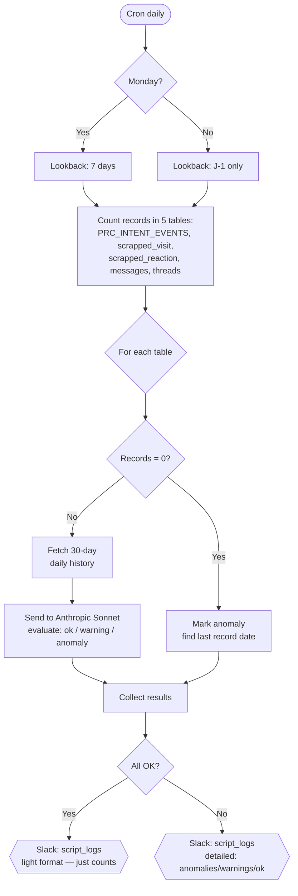
```mermaid
flowchart TD
    A([Cron daily]) --> B{Monday?}
    B -->|Yes| C[Lookback: 7 days]
    B -->|No| D[Lookback: J-1 only]
    C & D --> E["Count records in 5 tables:<br/>PRC_INTENT_EVENTS, scrapped_visit,<br/>scrapped_reaction, messages, threads"]
    E --> F{For each table}
    F --> G{Records = 0?}
    G -->|Yes| H[Mark anomaly<br/>find last record date]
    G -->|No| I[Fetch 30-day<br/>daily history]
    I --> J[Send to Anthropic Sonnet<br/>evaluate: ok / warning / anomaly]
    J --> K[Collect results]
    H --> K
    K --> L{All OK?}
    L -->|Yes| M{{Slack: script_logs<br/>light format — just counts}}
    L -->|No| N{{Slack: script_logs<br/>detailed: anomalies/warnings/ok}}
```

### `sync-modjo-calls` (hourly)

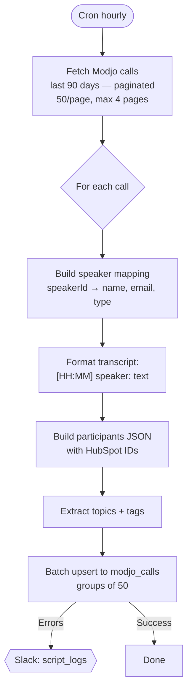
```mermaid
flowchart TD
    A([Cron hourly]) --> B[Fetch Modjo calls<br/>last 90 days — paginated<br/>50/page, max 4 pages]
    B --> C{For each call}
    C --> D[Build speaker mapping<br/>speakerId → name, email, type]
    D --> E["Format transcript:<br/>[HH:MM] speaker: text"]
    E --> F[Build participants JSON<br/>with HubSpot IDs]
    F --> G[Extract topics + tags]
    G --> H[Batch upsert to modjo_calls<br/>groups of 50]
    H -->|Errors| I{{Slack: script_logs}}
    H -->|Success| J[Done]
```

### `send-contacts-to-langgraph` (daily cron)

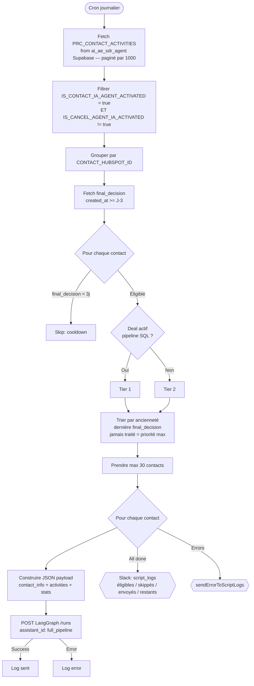
```mermaid
flowchart TD
    A([Cron journalier]) --> B[Fetch PRC_CONTACT_ACTIVITIES<br/>from ai_ae_sdr_agent Supabase — paginé par 1000]
    B --> C[Filtrer IS_CONTACT_IA_AGENT_ACTIVATED = true<br/>ET IS_CANCEL_AGENT_IA_ACTIVATED != true]
    C --> D[Grouper par CONTACT_HUBSPOT_ID]

    D --> E[Fetch final_decision<br/>created_at >= J-3]
    E --> F{Pour chaque contact}
    F -->|final_decision < 3j| G[Skip: cooldown]
    F -->|Éligible| H{Deal actif<br/>pipeline SQL ?}
    H -->|Oui| I[Tier 1]
    H -->|Non| J[Tier 2]

    I & J --> K[Trier par ancienneté<br/>dernière final_decision<br/>jamais traité = priorité max]
    K --> L[Prendre max 30 contacts]

    L --> M{Pour chaque contact}
    M --> N[Construire JSON payload<br/>contact_info + activities + stats]
    N --> O[POST LangGraph /runs<br/>assistant_id: full_pipeline]
    O -->|Success| P[Log sent]
    O -->|Error| Q[Log error]
    M -->|All done| R{{Slack: script_logs<br/>éligibles / skippés / envoyés / restants}}
    M -->|Errors| S{{sendErrorToScriptLogs}}
```

### `batch-crisp-to-supabase` (manual)

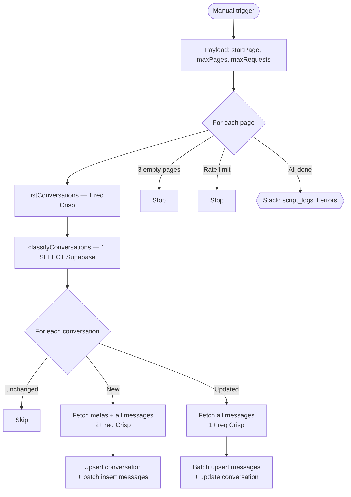
```mermaid
flowchart TD
    A([Manual trigger]) --> B[Payload: startPage, maxPages, maxRequests]
    B --> C{For each page}
    C --> D[listConversations — 1 req Crisp]
    D --> E[classifyConversations — 1 SELECT Supabase]
    E --> F{For each conversation}
    F -->|Unchanged| G[Skip]
    F -->|New| H[Fetch metas + all messages<br/>2+ req Crisp]
    H --> I[Upsert conversation<br/>+ batch insert messages]
    F -->|Updated| J[Fetch all messages<br/>1+ req Crisp]
    J --> K[Batch upsert messages<br/>+ update conversation]
    C -->|3 empty pages| L[Stop]
    C -->|Rate limit| M[Stop]
    C -->|All done| N{{Slack: script_logs if errors}}
```

### `daily-batch-crisp-to-supabase` (hourly cron, 25h gap — TEMPORARY)

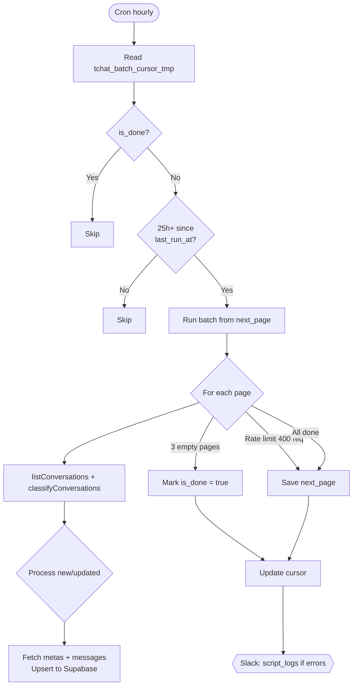
```mermaid
flowchart TD
    A([Cron hourly]) --> B[Read tchat_batch_cursor_tmp]
    B --> C{is_done?}
    C -->|Yes| D[Skip]
    C -->|No| E{25h+ since<br/>last_run_at?}
    E -->|No| F[Skip]
    E -->|Yes| G[Run batch from next_page]
    G --> H{For each page}
    H --> I[listConversations + classifyConversations]
    I --> J{Process new/updated}
    J --> K[Fetch metas + messages<br/>Upsert to Supabase]
    H -->|3 empty pages| L[Mark is_done = true]
    H -->|Rate limit 400 req| M[Save next_page]
    H -->|All done| M
    L --> N[Update cursor]
    M --> N
    N --> O{{Slack: script_logs if errors}}
```

### `sync-crisp-to-supabase` (cron)

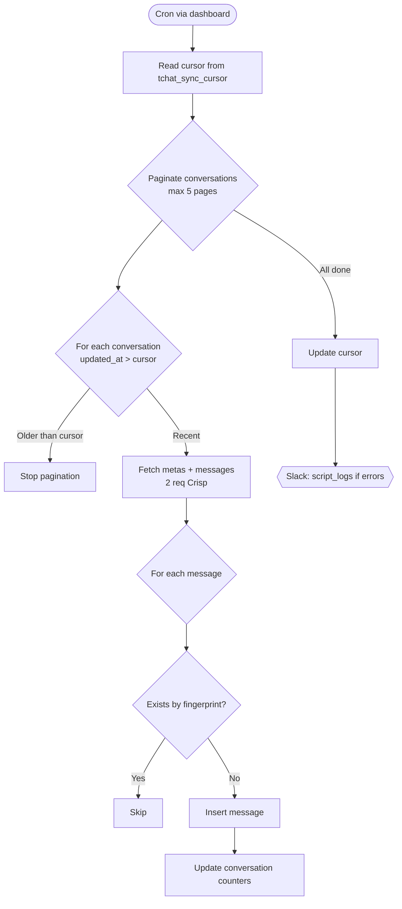
```mermaid
flowchart TD
    A([Cron via dashboard]) --> B[Read cursor from tchat_sync_cursor]
    B --> C{Paginate conversations<br/>max 5 pages}
    C --> D{For each conversation<br/>updated_at > cursor}
    D -->|Older than cursor| E[Stop pagination]
    D -->|Recent| F[Fetch metas + messages<br/>2 req Crisp]
    F --> G{For each message}
    G --> H{Exists by fingerprint?}
    H -->|Yes| I[Skip]
    H -->|No| J[Insert message]
    J --> K[Update conversation counters]
    C -->|All done| L[Update cursor]
    L --> M{{Slack: script_logs if errors}}
```

### `import-circle-posts` (weekly Friday 8h)

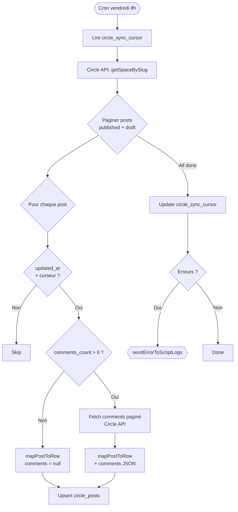
```mermaid
flowchart TD
    A([Cron vendredi 8h]) --> B[Lire circle_sync_cursor]
    B --> C[Circle API: getSpaceBySlug]
    C --> D{Paginer posts<br/>published + draft}
    D --> E{Pour chaque post}
    E --> F{updated_at<br/>> curseur ?}
    F -->|Non| G[Skip]
    F -->|Oui| H{comments_count > 0 ?}
    H -->|Non| I[mapPostToRow<br/>comments = null]
    H -->|Oui| J[Fetch comments paginé<br/>Circle API]
    J --> K[mapPostToRow<br/>+ comments JSON]
    I & K --> L[Upsert circle_posts]
    D -->|All done| M[Update circle_sync_cursor]
    M --> N{Erreurs ?}
    N -->|Oui| O{{sendErrorToScriptLogs}}
    N -->|Non| P[Done]
```

### `generate-faq-document` (manual)

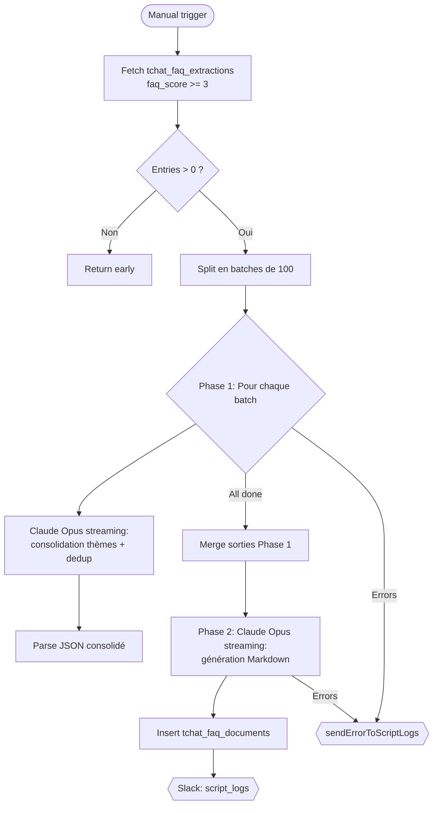
```mermaid
flowchart TD
    A([Manual trigger]) --> B[Fetch tchat_faq_extractions<br/>faq_score >= 3]
    B --> C{Entries > 0 ?}
    C -->|Non| D[Return early]
    C -->|Oui| E[Split en batches de 100]
    E --> F{Phase 1: Pour chaque batch}
    F --> G[Claude Opus streaming:<br/>consolidation thèmes + dedup]
    G --> H[Parse JSON consolidé]
    F -->|All done| I[Merge sorties Phase 1]
    I --> J[Phase 2: Claude Opus streaming:<br/>génération Markdown]
    J --> K[Insert tchat_faq_documents]
    K --> L{{Slack: script_logs}}
    F -->|Errors| M{{sendErrorToScriptLogs}}
    J -->|Errors| M
```

### `audit-circle-documentation` (manual)

```mermaid
flowchart TD
    A([Manual trigger]) --> B[Fetch tchat_faq_extractions<br/>score >= 3]
    B --> C[Fetch circle_posts<br/>published]
    C --> D[Extraire URLs Circle<br/>référencées dans FAQ]

    D --> E{Axe A: Pour chaque<br/>article référencé}
    E --> F{Déjà traité<br/>tchat_doc_audit_items ?}
    F -->|Oui| G[Skip resume]
    F -->|Non| H[Claude Opus:<br/>diagnostic + réécriture<br/>avec IMAGE_N placeholders]
    H --> I[Insert tchat_doc_audit_items<br/>status = done]

    D --> J{Axe B: Thèmes FAQ<br/>sans article Circle}
    J --> K{>= 3 entrées ?}
    K -->|Non| L[Skip]
    K -->|Oui| M[Claude Opus:<br/>brouillon nouvel article]
    M --> N[Insert tchat_doc_audit_items]

    D --> O[Axe C: Articles orphelins<br/>non référencés dans FAQ]

    I & N & O --> P[Assembler rapport Markdown<br/>avec TOC]
    P --> Q[Insert tchat_faq_documents<br/>type = doc_audit]
    Q --> R{{Slack: script_logs}}
```

### `weekly-unanswered-recap` (weekly Friday 8h30)

```mermaid
flowchart TD
    A([Cron vendredi 8h30]) --> B[Fetch workspace_team]

    B --> C{Pour chaque membre}
    C --> D[Supabase: scrapped_linkedin_threads<br/>1:1, last_activity >= lundi]
    D --> E[Supabase: scrapped_linkedin_messages<br/>derniers messages par thread]
    E --> F{Dernier msg sender<br/>= membre ?}
    F -->|Oui| G[Skip: déjà répondu]
    F -->|Non| H[Ajouter à liste<br/>LinkedIn non répondus]

    B --> I[Pour chaque EMAIL_RECAP_ACCOUNT:<br/>Unipile getEmails<br/>role=inbox + role=sent<br/>after=lundi before=vendredi]
    I --> J[Grouper par thread_id<br/>Exclure CATEGORY_PROMOTIONS etc.]
    J --> K{thread_id dans<br/>emails SENT ?}
    K -->|Oui| L[Skip: répondu]
    K -->|Non| M[Ajouter à liste<br/>Email non répondus]

    H & M --> N[Claude Sonnet:<br/>classifier important vs spam<br/>batches de 10]
    N -->|spam| O[Filtrer]
    N -->|important| P[Garder]

    P --> Q{Source = email ?}
    Q -->|Oui| R[HubSpot: chercher<br/>LinkedIn par email]
    Q -->|Non| S[LinkedIn URL<br/>depuis sender_data]

    R & S --> T[Construire message Slack<br/>groupé par membre]
    T --> U{{Slack API: chat.postMessage<br/>channel C032ZPKB51S}}

    C -->|Erreurs| V{{sendErrorToScriptLogs}}
```

### `propose-faq-updates` (manual monthly)

```mermaid
flowchart TD
    A([Manuel mensuel]) --> B[Lire FAQ de référence<br/>tchat_faq_documents type=faq_approved]
    B --> C{FAQ trouvée ?}
    C -->|Non| D[Erreur: upload FAQ d'abord]
    C -->|Oui| E[Parser TOC + index par question]

    E --> F[Fetch extractions Crisp<br/>derniers 30 jours, score >= 3]
    F --> G[Fetch articles Circle<br/>derniers 30 jours]

    G --> H{Passe 1 — Triage<br/>Opus : TOC + extractions<br/>batchs de 50}
    H --> I[JSON propositions :<br/>new_question / update_answer<br/>remove_question / update_article<br/>new_article]

    I --> J[Dédupliquer propositions]
    J --> K{Passe 2 — Détail}
    K -->|update_answer| L[Opus : contenu FAQ actuel<br/>+ extractions → avant/après]
    K -->|new_question| M[Opus : extractions<br/>→ titre + réponse]
    K -->|update/new article| N[Opus : article Circle<br/>+ extractions → proposition]
    K -->|remove_question| O[Raison suffisante]

    L & M & N & O --> P[Assembler HTML<br/>diff coloré + TOC]
    P --> Q[Insert tchat_faq_documents<br/>type = faq_proposal]
    Q --> R{{Slack: script_logs}}
```

## Important Rules

- **Edge Function `/functions/v1/enrich`**: This is the enrichment function hosted on Supabase. **Never reinvent or replace it.** Always call it as-is with `{ parameter: "all", contact_linkedin_url: "http://linkedin.com/in/{id}" }`.
- **Lazy initialization**: Supabase and Unipile clients must NOT initialize at import time (env vars unavailable during Trigger.dev Docker build). Use lazy-init patterns.
- **Ghost Genius account IDs**: Still used as keys in `workspace_team` to look up `unipile_account_id`. The Ghost Genius API itself is no longer used.
- **Error reporting sur Slack** : Toute task Trigger.dev doit envoyer un recap d'erreur sur le webhook `script_logs` quand il y a des erreurs, via `sendErrorToScriptLogs()` de `trigger/lib/utils.ts`. Le message doit identifier clairement la task et être lisible d'un coup d'oeil. Exemple de bon message :
  ```
  [Strategic People SalesNav] ⚠️ Erreurs — 2026-02-18 14:30

  📊 Résultats
  • CIO - DSI France: 5 insérés | 0 ignorés
  • PMO France: 3 insérés | 1 ignoré

  ❌ Erreurs (3)
  • CIO - DSI France: 1x Enrichissement (404), 1x Supabase Upsert (23505)
  • PMO France: 1x Enrichissement (timeout)

  Total: 3 erreurs
  ```
  Les webhooks d'activité existants (recap succès, notifications métier) sont séparés et ne remplacent pas cette alerte erreur.

## Agent Workflow Rules

### Plan Mode
- Enter plan mode for ANY non-trivial task (3+ steps or architectural decisions)
- If something goes sideways, STOP and re-plan immediately
- Use plan mode for verification steps, not just building
- Write detailed specs upfront to reduce ambiguity

### Subagents
- Use subagents liberally to keep main context window clean
- Offload research, exploration, and parallel analysis to subagents
- For complex problems, throw more compute at it via subagents
- One task per subagent for focused execution

### Self-Improvement
- After ANY correction from the user: update memory with the pattern
- Write rules that prevent the same mistake recurring
- Review lessons at session start for relevant project context

### Verification
- Never mark a task complete without proving it works
- Diff behavior between main and your changes when relevant
- Ask yourself: "Would a staff engineer approve this?"
- Run TypeScript compilation, check logs, demonstrate correctness

### Elegance (Balanced)
- For non-trivial changes: pause and ask "is there a more elegant way?"
- If a fix feels hacky, step back and implement the clean solution
- Skip this for simple, obvious fixes — don't over-engineer

### Autonomous Bug Fixing
- When given a bug report: investigate and fix it autonomously
- Point at logs, errors, failing tests — then resolve them
- Zero context switching required from the user

### Task Management
- Plan first: write plan with checkable items
- Track progress: mark items complete as you go
- Explain changes: high-level summary at each step
- Capture lessons: update memory after corrections

### Core Principles
- **Simplicity first**: make every change as simple as possible, minimal code impact
- **No laziness**: find root causes, no temporary fixes, senior developer standards
- **Minimal impact**: changes should only touch what's necessary

## Supabase Tables

### `scrapped_visit`
- Profile view visits (from `get-profil-views`)
- Unique on: `(profil_linkedin_url_reaction, linkedin_url_profil_visited, date_scrapped_calculated)`

### `scrapped_strategic_connection_concurrent`
- Sales Navigator concurrent profiles (from `get-strategic-connections`)
- Unique on: `(linkedin_private_id, sales_nav_description)`

### `workspace_team`
- Maps `ghost_genius_account_id` → `unipile_account_id`
- Contains LinkedIn URLs and team member info

### `scrapped_connection`
- 1st-degree LinkedIn connections (from `get-team-connections`)
- PK composite: `(profil_linkedin_url_connection, linkedin_url_owner_post)`
- `created_at`: scraping date (YYYY-MM-DD), `connected_at`: connection date
- `contact_urn`: LinkedIn member ID (ACoAA... format)
- ⚠️ URLs stored without trailing `/`

### `new_scrapp_strategic_people_salesnav`
- Strategic people from Sales Navigator (from `get-strategic-people`)
- PK composite: `(linkedin_private_url, saved_search_name)`

### `enriched_contacts`
- Cache for ACo URL → enriched slug resolution

### `PRC_INTENT_EVENTS`
- Intent events (reactions, comments, visits, follows) from `lgm-process-intent-events`
- Read-only: filtered on `EVENT_RECORDED_ON` J-1, `CONTACT_JOB_STRATEGIC_ROLE` non null
- Fields: `CONTACT_FIRST_NAME`, `CONTACT_LAST_NAME`, `CONTACT_LINKEDIN_PROFILE_URL`, `COMPANY_NAME`, `CONTACT_JOB`, `CONTACT_HUBSPOT_ID`, `BUSINESS_OWNER`, `INTENT_EVENT_TYPE`, `CONNECTED_WITH_BUSINESS_OWNER`, `INTENT_OWNER`, `CONNECTED_WITH_INTENT_OWNER`, `EVENT_RECORD_ORIGIN`

### `PRC_CONTACTS`
- Read-only: lookup `CONTACT_HUBSPOT_ID` by `CONTACT_LINKEDIN_PROFILE_URL`
- Used by `lgm-process-intent-events` for concurrent contacts HubSpot routing

### `lgm_send_log`
- Audit log for every routing decision in `lgm-process-intent-events` (from both intent events and concurrent contacts)
- PK: `id` (bigserial)
- `destination`: audience name for LGM sends, or `HUBSPOT_ACTIVATE` / `HUBSPOT_ASSIGN` / `HUBSPOT_CREATE` / `SKIPPED` / `EXCLUDED` / `UNMAPPED`
- `source`: `intent_event` or `concurrent_contact`
- `lgm_http_status`, `lgm_response_msg`, `lgm_lead_id`: LGM API response details (null for non-LGM routes)
- `hubspot_contact_id`, `hubspot_success`: HubSpot routing details (null for non-HubSpot routes)
- `connected_with_intent_owner`: SNAPSHOT at processing time (important: this field is live in PRC_INTENT_EVENTS)
- `skip_reason`: `excluded_profile` / `unmapped_key` / `cancel_agent_ia` / `cross_owner` / `no_hubspot_id` / `unknown_page_origin`
- `run_id`: UUID generated per task run for correlation
- Indexed on `(created_at, destination)`
- Used by `audit-lgm-sends` for weekly reporting

### `scrapped_linkedin_threads`
- LinkedIn messaging threads (from `import-linkedin-messages`)
- PK: `id` (LinkedIn thread ID, format `2-base64...`)
- `last_activity_at`: ISO timestamp, `is_read`: boolean
- `participants`: JSON array in Ghost Genius format (`{id, type, full_name, url, profile_picture}`)
- `participant_owner_id`: team member's `linkedin_urn` (ACoAA...)
- `participants_ids`: array of all participant URNs, `participants_numbers`: count
- `main_participant_id`: other participant URN for 1:1 threads

### `scrapped_linkedin_messages`
- LinkedIn messages (from `import-linkedin-messages`)
- PK: `id` (format `urn:li:msg_message:(urn:li:fsd_profile:${owner_urn},${msg_provider_id})`)
- `thread_id`: references `scrapped_linkedin_threads.id`
- `message_date`: ISO timestamp, `is_read`: boolean, `text`: message content
- `sender_id`: sender's LinkedIn URN (ACoAA...)
- `sender_data`: JSON in Ghost Genius format (`{id, type, full_name, url, profile_picture}`)
- `hubspot_communication_id`: HubSpot communication ID (set after HubSpot sync for 1:1 threads)
- `participant_owner_id`, `participants_numbers`, `main_participant_id`: denormalized from thread

### `modjo_calls`
- Modjo calls synced hourly (from `sync-modjo-calls`)
- PK: `call_id` (Modjo call ID)
- `hubspot_deal_id`, `hubspot_account_id`, `hubspot_contact_ids`: HubSpot associations
- `participants`: JSON array `[{name, email, type, hubspot_id}]`
- `ai_summary`: Modjo AI-generated summary
- `transcript_clean`: formatted transcript with speaker names and timestamps
- `topics`, `tags`: string arrays
- `raw_data`: full Modjo API response

### `final_decision`
- **Supabase project**: `rcpcdpxqjxeikbssprdz` (ai_ae_sdr_agent) — read via `AI_AE_SDR_SUPABASE_URL`/`AI_AE_SDR_SUPABASE_KEY`
- LangGraph agent output: recommendations per contact
- PK: `id` (serial)
- `contact_hubspot_id`: HubSpot contact ID
- `session_id`: LangGraph session ID
- `decision`: JSON string (action, message, sequence_plan, risk_factors, evidence_trail...)
- `created_at`: timestamp of recommendation
- `user_slack_message`, `type_of_validation`: user feedback fields
- Used by `send-contacts-to-langgraph` for cooldown check (skip if decision < 3 days)

### `PRC_CONTACT_ACTIVITIES`
- **Supabase project**: `rcpcdpxqjxeikbssprdz` (ai_ae_sdr_agent) — read via `AI_AE_SDR_SUPABASE_URL`/`AI_AE_SDR_SUPABASE_KEY`
- Contact activities synced via Airbyte, read-only
- Fields: `CONTACT_HUBSPOT_ID`, `CONTACT_FULL_NAME`, `CONTACT` (JSON), `DEALS` (JSON), `OWNER_INTENT_HUBSPOT` (JSON), `OWNER_CONTACT_INTENT_HUBSPOT` (JSON), `SENDER` (JSON), `ACTIVITY_ID`, `ACTIVITY_TYPE`, `ACTIVITY_RECORDED_ON`, `ACTIVITY_DIRECTION`, `ACTIVITY_METADATA` (JSON), `IS_CONTACT_IA_AGENT_ACTIVATED`, `IS_CANCEL_AGENT_IA_ACTIVATED`, `_airbyte_generation_id`
- Used by `send-contacts-to-langgraph`

### `tchat_conversations`
- **Supabase project**: `oqiowupiczgrezgyopfm` (tchat-support-sync) — via `TCHAT_SUPPORT_SYNC_SUPABASE_URL`/`TCHAT_SUPPORT_SYNC_SUPABASE_SERVICE_KEY`
- Crisp conversations (from `batch-crisp-to-supabase` and `sync-crisp-to-supabase`)
- PK: `session_id` (Crisp session ID)
- `website_id`, `contact_email`, `contact_name`, `state` (pending/unresolved/resolved)
- `message_count_inbound`, `message_count_outbound`, `first_message_at`, `last_message_at`
- `metadata`: JSON (Crisp meta object)

### `tchat_messages`
- **Supabase project**: `oqiowupiczgrezgyopfm` (tchat-support-sync)
- Crisp messages (from `batch-crisp-to-supabase` and `sync-crisp-to-supabase`)
- Unique on: `fingerprint` (Crisp message fingerprint)
- `session_id`: references `tchat_conversations.session_id`
- `direction`: INBOUND (user) / OUTBOUND (operator)
- `content_type`: text, file, note, etc.
- `crisp_timestamp`: original Crisp timestamp
- `raw_data`: full Crisp message object

### `tchat_sync_cursor`
- **Supabase project**: `oqiowupiczgrezgyopfm` (tchat-support-sync)
- Sync cursor for incremental sync (from `sync-crisp-to-supabase`)
- PK: `website_id`
- `last_synced_at`: ISO timestamp of last synced conversation

### `tchat_batch_cursor_tmp` (TEMPORARY)
- **Supabase project**: `oqiowupiczgrezgyopfm` (tchat-support-sync)
- **À SUPPRIMER** une fois l'import historique Crisp terminé (quand `is_done = true`)
- Batch cursor for `daily-batch-crisp-to-supabase`
- PK: `website_id`
- `next_page`: next Crisp page to import
- `last_run_at`: ISO timestamp of last actual batch execution (used for 25h gap check)
- `is_done`: true when 3 empty pages found (no more conversations to import)

### `circle_posts`
- **Supabase project**: `oqiowupiczgrezgyopfm` (tchat-support-sync)
- Circle posts imported weekly (from `import-circle-posts`)
- PK: `id` (Circle post ID)
- `space_slug`, `space_id`, `space_name`: Circle space info
- `body_html`: HTML content, `tiptap_body`: TipTap JSON, `body_plain_text`: plain text
- `images`: jsonb (gallery + inline TipTap images), `attachments`: jsonb
- `comments`: jsonb (all comments with nested replies, fetched from Circle API)
- `comments_count`, `likes_count`: counters from Circle
- `user_id`, `user_name`, `user_email`: post author
- `published_at`, `created_at`, `updated_at`: Circle timestamps
- `last_synced_at`: last sync timestamp

### `circle_sync_cursor`
- **Supabase project**: `oqiowupiczgrezgyopfm` (tchat-support-sync)
- Sync cursor for incremental Circle import (from `import-circle-posts`)
- PK: `space_slug`
- `last_synced_at`: ISO timestamp of latest `updated_at` seen

### `tchat_faq_documents`
- **Supabase project**: `oqiowupiczgrezgyopfm` (tchat-support-sync)
- Generated FAQ documents (from `generate-faq-document`)
- PK: `id` (serial)
- `version`: auto-incrementing version number
- `generated_at`: ISO timestamp
- `model_used`: Claude model used (e.g. `claude-opus-4-20250514`)
- `markdown`: full Markdown document text
- `stats`: jsonb `{ total_entries_before, total_entries_after, total_themes, min_score }`
- `metadata`: jsonb `{ batch_count, generation_duration_ms }`
- `type`: text (`faq` default, `doc_audit` for audit reports) — versions are per type

### `tchat_doc_audit_items`
- **Supabase project**: `oqiowupiczgrezgyopfm` (tchat-support-sync)
- Individual audit results for resume support (from `audit-circle-documentation`)
- PK: `id` (serial)
- `audit_run_id`: text, groups items by run
- `article_url`: article URL (null for new article drafts)
- `article_name`: article title
- `audit_type`: `update`, `create`, or `orphan`
- `analysis`: full Opus analysis text (diagnostic + rewrite)
- `image_mapping`: jsonb, `[IMAGE_N]` → original URL mapping
- `status`: `pending` or `done`

## External APIs (non-Unipile)

- **LGM (LaGrowthMachine)**: `POST https://apiv2.lagrowthmachine.com/flow/leads?apikey=X` — send leads with audience name. Env var: `LGM_API_KEY`
- **HubSpot**: `GET/PATCH/POST https://api.hubapi.com/crm/v3/objects/contacts` — manage contacts, `agent_ia_activated` property. Env var: `HUBSPOT_ACCESS_TOKEN`
- **Anthropic**: `POST https://api.anthropic.com/v1/messages` — AI-generated Slack recaps (claude-sonnet-4-20250514). Env var: `ANTHROPIC_API_KEY`
- **Slack Webhook** (meetings recap): `POST` to `webhook_sql_activity` — weekly meetings recap channel
- **Slack Webhook** (intent events): `POST` to `webhook_intent_events_lgm_activity` — daily intent events recap
- **Slack Webhook** (error log): `POST` to `script_logs` — script error alerts
- **Zapier Webhook** (LinkedIn messages): `POST` to `webhook_linkedin_message` — LinkedIn message enrichment
- **Zapier Webhook** (deal clean alert): `POST` to `webhook_team_sales` — deal cleaning alerts
- **Modjo**: `POST https://api.modjo.ai/v1/calls/exports` — export calls with transcripts, speakers, HubSpot relations. Auth: `X-API-KEY` header. Env var: `MODJO_API_KEY`
- **LangGraph**: `POST {LANGGRAPH_BASE_URL}/runs` — async agent run with `{ assistant_id: "full_pipeline", input: { contact_data: payload } }`. Auth: `x-api-key` header. Env vars: `LANGGRAPH_BASE_URL` (prod/staging URLs differ), `LANGGRAPH_API_KEY`
- **Crisp**: `GET/POST https://api.crisp.chat/v1/website/{websiteId}/...` — conversations, messages, metas. Auth: HTTP Basic (`CRISP_IDENTIFIER:CRISP_KEY`), header `X-Crisp-Tier: plugin`. Rate limit: 500 req/24h. Env vars: `CRISP_IDENTIFIER`, `CRISP_KEY`, `CRISP_WEBSITE_ID`
- **Circle**: `GET https://{CIRCLE_COMMUNITY_HOST}/api/admin/v2/...` — spaces, posts, comments. Auth: `Authorization: Token {CIRCLE_API_TOKEN}`. Rate limit: 300 req/min. Env vars: `CIRCLE_API_TOKEN`, `CIRCLE_COMMUNITY_HOST`

## Unipile API

- **Search**: `POST /linkedin/search?account_id=X` with `{ url: "...savedSearchId=...&lastViewedAt=<timestamp_ms>" }` — cursor-based pagination, 10 items/page. `lastViewedAt` is a native Sales Navigator URL parameter that filters to only new results since that timestamp.
- **Raw route**: `POST /linkedin` — proxy to LinkedIn Voyager GraphQL
- **Get user**: `GET /users/{identifier}?account_id=X`
- **Get relations**: `GET /users/relations?account_id=X&limit=N&cursor=C` — returns `UserRelationsList` with items sorted by `created_at` desc. Each `UserRelation` has `first_name`, `last_name`, `headline`, `public_profile_url` (trailing `/`), `member_id` (ACoAA...), `created_at` (timestamp ms)
- **Get chats**: `GET /chats?account_id=X&limit=N&after=ISO&cursor=C` — list messaging threads, cursor-based pagination. `after` filters by activity date.
- **Get chat messages**: `GET /chats/{chatId}/messages?limit=N&cursor=C` — messages for a thread, cursor-based pagination
- **Get chat attendees**: `GET /chats/{chatId}/attendees` — participants of a thread (only returns non-self, `is_self: 0`)
