# Project: LinkedIn Scrapp — Trigger.dev Tasks

## Architecture

- **Runtime**: Trigger.dev v3 (`schedules.task`)
- **Deploy**: GitHub Actions → Trigger.dev (on push to `main` or `staging`)
- **Project ref**: `proj_qnvzrrduyvfunicemipq`
- **Env vars**: configured in Trigger.dev dashboard (not in code), per environment
- **Cron**: configured via Trigger.dev dashboard (not in code)
- **Secret key (prod)**: `tr_prod_TOBy4NubZXOQASLQDR2n` — used for Management API auth

## Trigger.dev Management API

Base URL: `https://api.trigger.dev`, auth via `Authorization: Bearer <secret_key>`.

- **List env vars**: `GET /api/v1/projects/proj_qnvzrrduyvfunicemipq/envvars`
- **Create env var**: `POST /api/v1/projects/proj_qnvzrrduyvfunicemipq/envvars/{env}` with `{"name":"VAR_NAME","value":"value"}` (env = `dev`, `staging`, or `prod`)
- **List runs**: `GET /api/v1/runs?filter[status]=FAILED&page[size]=10`
- **Get run details**: `GET /api/v3/runs/{runId}` (includes `error` field with name, message, stackTrace)

## Key Files

- `trigger/get-profil-views.ts` — scrapes LinkedIn profile viewers via GraphQL Voyager endpoint
- `trigger/get-strategic-connections.ts` — scrapes Sales Navigator saved searches for new concurrent profiles
- `trigger/get-strategic-people.ts` — scrapes Sales Navigator saved searches for strategic people (CIO, PMO, etc.)
- `trigger/get-team-connections.ts` — fetches 1st-degree LinkedIn connections for all team members
- `trigger/lgm-process-intent-events.ts` — processes J-1 intent events + concurrent contacts → routes to LGM or HubSpot, sends grouped Slack recap. Also exports `lgm-process-intent-events-10-days` backfill task (same logic, 10-day lookback)
- `trigger/hubspot-cleanup-email-associations.ts` — removes parasitic email-contact associations in HubSpot (emails with >3 contacts where contact not in from/to/cc/bcc)
- `trigger/import-linkedin-messages.ts` — imports LinkedIn messages from last 24h via Unipile → Supabase, sends 1:1 messages to HubSpot (communication) + Zapier webhook
- `trigger/weekly-meetings-recap.ts` — weekly Monday recap of HubSpot meetings in SQL pipeline, enriched with AI (Anthropic Sonnet) and sent to Slack
- `trigger/deal-clean-alert.ts` — alerts on deals needing cleanup (date dépassée, sans date en RDV à planifier, sans montant après Demo) via Zapier webhook
- `trigger/data-freshness-check.ts` — daily monitoring of Supabase table freshness (PRC_INTENT_EVENTS, scrapped_visit, scrapped_reaction, messages, threads), uses Claude Sonnet for anomaly detection, alerts on script_logs
- `trigger/sync-modjo-calls.ts` — syncs Modjo calls (transcripts, participants, HubSpot IDs, AI summaries) to Supabase `modjo_calls` table via Modjo API, hourly cron
- `trigger/lib/unipile.ts` — Unipile API client (rawRoute, getUser, search, getRelations, getChats, getChatMessages, getChatAttendees)
- `trigger/lib/supabase.ts` — Supabase client (lazy-init via Proxy)
- `trigger/lib/utils.ts` — shared helpers (sleep, parseViewedAgoText, etc.)

## Task Flow Diagrams

> **Rule**: Update these diagrams whenever a task is modified.

### Overview


### `get-profil-views` (daily)

```mermaid
flowchart TD
    A([Cron daily]) --> B[Fetch workspace_team<br/>with unipile_account_id]
    B --> C{For each<br/>team member}
    C --> D[Fetch LinkedIn Voyager GraphQL<br/>profile viewers — paginated]
    D --> E{Filter each viewer}
    E -->|URL contains /search/| F[Skip: anonymous]
    E -->|URL without /in/| G[Skip: non-profile]
    E -->|Age > 24h| H[Skip: too old]
    E -->|Valid| I[Resolve ACo URL → slug<br/>via enriched_contacts cache<br/>or Unipile getUser]
    I --> J[Upsert to scrapped_visit]
    J --> K[Upsert to enriched_contacts]
    C -->|All done| L{{Slack: webhook_succes_profil_view}}
    C -->|Errors| M{{Slack: script_logs}}
```



### `get-strategic-connections` (daily)


### `get-strategic-people` (daily)


### `get-team-connections` (daily)


### `lgm-process-intent-events` (daily + 10-day backfill)

#### Intent Events Routing


#### Concurrent Contacts Routing


### `hubspot-cleanup-email-associations` (daily)


### `import-linkedin-messages` (hourly)


### `weekly-meetings-recap` (weekly Monday)


### `deal-clean-alert` (daily)

```mermaid
flowchart TD
    A([Cron daily]) --> B[Fetch PRC_DEAL_UPSELL_AND_SQL]
    B --> C[Fetch workspace_team<br/>for owner → Slack mapping]
    C --> D{Apply 3 rules}
    D --> E["Rule 1: Date dépassée<br/>DEAL_CLOSED_DATE < today<br/>+ deal not closed"]
    D --> F["Rule 2: Sans date<br/>stage = RDV à planifier<br/>+ no DEAL_CLOSED_DATE"]
    D --> G["Rule 3: Sans montant<br/>stage post-Demo<br/>+ amount null/0"]
    E & F & G --> H[Group flagged deals<br/>by owner + rule]
    H --> I{Any deals<br/>flagged?}
    I -->|Yes| J{{Zapier: webhook_team_sales<br/>per-owner alert with @mentions}}
    I -->|No| K[Done]
    A -->|Fatal error| L{{Slack: script_logs}}
```



### `data-freshness-check` (daily)

```mermaid
flowchart TD
    A([Cron daily]) --> B{Monday?}
    B -->|Yes| C[Lookback: 7 days]
    B -->|No| D[Lookback: J-1 only]
    C & D --> E["Count records in 5 tables:<br/>PRC_INTENT_EVENTS, scrapped_visit,<br/>scrapped_reaction, messages, threads"]
    E --> F{For each table}
    F --> G{Records = 0?}
    G -->|Yes| H[Mark anomaly<br/>find last record date]
    G -->|No| I[Fetch 30-day<br/>daily history]
    I --> J[Send to Anthropic Sonnet<br/>evaluate: ok / warning / anomaly]
    J --> K[Collect results]
    H --> K
    K --> L{All OK?}
    L -->|Yes| M{{Slack: script_logs<br/>light format — just counts}}
    L -->|No| N{{Slack: script_logs<br/>detailed: anomalies/warnings/ok}}
```



### `sync-modjo-calls` (hourly)


## Important Rules

- **Edge Function `/functions/v1/enrich`**: This is the enrichment function hosted on Supabase. **Never reinvent or replace it.** Always call it as-is with `{ parameter: "all", contact_linkedin_url: "http://linkedin.com/in/{id}" }`.
- **Lazy initialization**: Supabase and Unipile clients must NOT initialize at import time (env vars unavailable during Trigger.dev Docker build). Use lazy-init patterns.
- **Ghost Genius account IDs**: Still used as keys in `workspace_team` to look up `unipile_account_id`. The Ghost Genius API itself is no longer used.
- **Error reporting sur Slack** : Toute task Trigger.dev doit envoyer un recap d'erreur sur le webhook `script_logs` quand il y a des erreurs, via `sendErrorToScriptLogs()` de `trigger/lib/utils.ts`. Le message doit identifier clairement la task et être lisible d'un coup d'oeil. Exemple de bon message :
  ```
  [Strategic People SalesNav] ⚠️ Erreurs — 2026-02-18 14:30

  📊 Résultats
  • CIO - DSI France: 5 insérés | 0 ignorés
  • PMO France: 3 insérés | 1 ignoré

  ❌ Erreurs (3)
  • CIO - DSI France: 1x Enrichissement (404), 1x Supabase Upsert (23505)
  • PMO France: 1x Enrichissement (timeout)

  Total: 3 erreurs
  ```
  Les webhooks d'activité existants (recap succès, notifications métier) sont séparés et ne remplacent pas cette alerte erreur.

## Supabase Tables

### `scrapped_visit`
- Profile view visits (from `get-profil-views`)
- Unique on: `(profil_linkedin_url_reaction, linkedin_url_profil_visited, date_scrapped_calculated)`

### `scrapped_strategic_connection_concurrent`
- Sales Navigator concurrent profiles (from `get-strategic-connections`)
- Unique on: `(linkedin_private_id, sales_nav_description)`

### `workspace_team`
- Maps `ghost_genius_account_id` → `unipile_account_id`
- Contains LinkedIn URLs and team member info

### `scrapped_connection`
- 1st-degree LinkedIn connections (from `get-team-connections`)
- PK composite: `(profil_linkedin_url_connection, linkedin_url_owner_post)`
- `created_at`: scraping date (YYYY-MM-DD), `connected_at`: connection date
- `contact_urn`: LinkedIn member ID (ACoAA... format)
- ⚠️ URLs stored without trailing `/`

### `new_scrapp_strategic_people_salesnav`
- Strategic people from Sales Navigator (from `get-strategic-people`)
- PK composite: `(linkedin_private_url, saved_search_name)`

### `enriched_contacts`
- Cache for ACo URL → enriched slug resolution

### `PRC_INTENT_EVENTS`
- Intent events (reactions, comments, visits, follows) from `lgm-process-intent-events`
- Read-only: filtered on `EVENT_RECORDED_ON` J-1, `CONTACT_JOB_STRATEGIC_ROLE` non null
- Fields: `CONTACT_FIRST_NAME`, `CONTACT_LAST_NAME`, `CONTACT_LINKEDIN_PROFILE_URL`, `COMPANY_NAME`, `CONTACT_JOB`, `CONTACT_HUBSPOT_ID`, `BUSINESS_OWNER`, `INTENT_EVENT_TYPE`, `CONNECTED_WITH_BUSINESS_OWNER`, `INTENT_OWNER`, `CONNECTED_WITH_INTENT_OWNER`, `EVENT_RECORD_ORIGIN`

### `PRC_CONTACTS`
- Read-only: lookup `CONTACT_HUBSPOT_ID` by `CONTACT_LINKEDIN_PROFILE_URL`
- Used by `lgm-process-intent-events` for concurrent contacts HubSpot routing

### `scrapped_linkedin_threads`
- LinkedIn messaging threads (from `import-linkedin-messages`)
- PK: `id` (LinkedIn thread ID, format `2-base64...`)
- `last_activity_at`: ISO timestamp, `is_read`: boolean
- `participants`: JSON array in Ghost Genius format (`{id, type, full_name, url, profile_picture}`)
- `participant_owner_id`: team member's `linkedin_urn` (ACoAA...)
- `participants_ids`: array of all participant URNs, `participants_numbers`: count
- `main_participant_id`: other participant URN for 1:1 threads

### `scrapped_linkedin_messages`
- LinkedIn messages (from `import-linkedin-messages`)
- PK: `id` (format `urn:li:msg_message:(urn:li:fsd_profile:${owner_urn},${msg_provider_id})`)
- `thread_id`: references `scrapped_linkedin_threads.id`
- `message_date`: ISO timestamp, `is_read`: boolean, `text`: message content
- `sender_id`: sender's LinkedIn URN (ACoAA...)
- `sender_data`: JSON in Ghost Genius format (`{id, type, full_name, url, profile_picture}`)
- `hubspot_communication_id`: HubSpot communication ID (set after HubSpot sync for 1:1 threads)
- `participant_owner_id`, `participants_numbers`, `main_participant_id`: denormalized from thread

### `modjo_calls`
- Modjo calls synced hourly (from `sync-modjo-calls`)
- PK: `call_id` (Modjo call ID)
- `hubspot_deal_id`, `hubspot_account_id`, `hubspot_contact_ids`: HubSpot associations
- `participants`: JSON array `[{name, email, type, hubspot_id}]`
- `ai_summary`: Modjo AI-generated summary
- `transcript_clean`: formatted transcript with speaker names and timestamps
- `topics`, `tags`: string arrays
- `raw_data`: full Modjo API response

## External APIs (non-Unipile)

- **LGM (LaGrowthMachine)**: `POST https://apiv2.lagrowthmachine.com/flow/leads?apikey=X` — send leads with audience name. Env var: `LGM_API_KEY`
- **HubSpot**: `GET/PATCH/POST https://api.hubapi.com/crm/v3/objects/contacts` — manage contacts, `agent_ia_activated` property. Env var: `HUBSPOT_ACCESS_TOKEN`
- **Anthropic**: `POST https://api.anthropic.com/v1/messages` — AI-generated Slack recaps (claude-sonnet-4-20250514). Env var: `ANTHROPIC_API_KEY`
- **Slack Webhook** (meetings recap): `POST` to `webhook_sql_activity` — weekly meetings recap channel
- **Slack Webhook** (intent events): `POST` to `webhook_intent_events_lgm_activity` — daily intent events recap
- **Slack Webhook** (error log): `POST` to `script_logs` — script error alerts
- **Zapier Webhook** (LinkedIn messages): `POST` to `webhook_linkedin_message` — LinkedIn message enrichment
- **Zapier Webhook** (deal clean alert): `POST` to `webhook_team_sales` — deal cleaning alerts
- **Modjo**: `POST https://api.modjo.ai/v1/calls/exports` — export calls with transcripts, speakers, HubSpot relations. Auth: `X-API-KEY` header. Env var: `MODJO_API_KEY`

## Unipile API

- **Search**: `POST /linkedin/search?account_id=X` with `{ url: "...savedSearchId=...&lastViewedAt=<timestamp_ms>" }` — cursor-based pagination, 10 items/page. `lastViewedAt` is a native Sales Navigator URL parameter that filters to only new results since that timestamp.
- **Raw route**: `POST /linkedin` — proxy to LinkedIn Voyager GraphQL
- **Get user**: `GET /users/{identifier}?account_id=X`
- **Get relations**: `GET /users/relations?account_id=X&limit=N&cursor=C` — returns `UserRelationsList` with items sorted by `created_at` desc. Each `UserRelation` has `first_name`, `last_name`, `headline`, `public_profile_url` (trailing `/`), `member_id` (ACoAA...), `created_at` (timestamp ms)
- **Get chats**: `GET /chats?account_id=X&limit=N&after=ISO&cursor=C` — list messaging threads, cursor-based pagination. `after` filters by activity date.
- **Get chat messages**: `GET /chats/{chatId}/messages?limit=N&cursor=C` — messages for a thread, cursor-based pagination
- **Get chat attendees**: `GET /chats/{chatId}/attendees` — participants of a thread (only returns non-self, `is_self: 0`)
